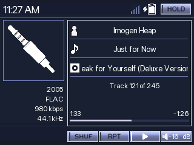
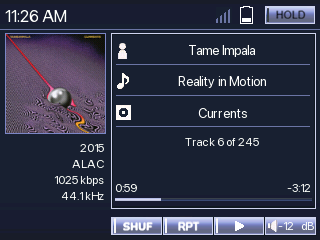
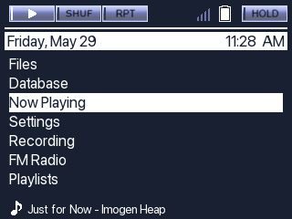
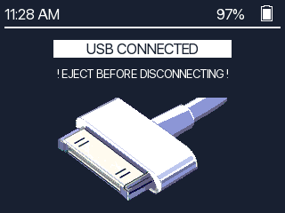

# entune_audio

Version 1.0

Last Update: 05/29/2026

License: CC-BY-SA 3.0

By: Monica G.

Description: Theme based on the Entune Audio media system. Fonts are the SF-Pro fonts, all pixel art is by me. All icons are made by me and/or updated from my previous themes. (minimal_RTC_sync and bunnyPod).

The San Francisco font is owned by Apple Inc. and this theme does not claim any ownership over the font.

Code based on: minimal_RTC_sync and bunnyPod which were based on SNARTY by Simon Anden and BONES by Chuck Largo!

## fonts
- SF-Pro

## wps screenshots

## menu screenshot

## usb screenshot

